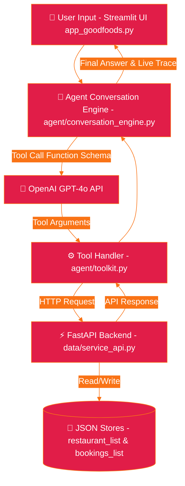

<!-- palette: #E11D48, #F97316 | theme: Culinary Crimson & Sunset Amber - Conversational AI Restaurant Reservations -->

<div align="center">


<a href="https://readme-typing-svg.demolab.com">
  
</a>

<p align="center">
  <b>Conversational AI assistant that discovers restaurants and books table reservations in real time.</b>
</p>

<p align="center">
  <a href="https://github.com/Shikhar-Kesharwani/FoodPilot/graphs/contributors"></a>
  <a href="https://github.com/Shikhar-Kesharwani/FoodPilot/network/members"></a>
  <a href="https://github.com/Shikhar-Kesharwani/FoodPilot/stargazers"></a>
  <a href="https://github.com/Shikhar-Kesharwani/FoodPilot/issues"></a>
  <a href="https://github.com/Shikhar-Kesharwani/FoodPilot/blob/main/LICENSE"></a>
</p>

---

</div>

## 📑 Table of Contents

- [🎯 Overview](#-overview)
- [✨ Key Features](#-key-features)
- [🖼️ Architecture Framework](#️-architecture-framework)
- [💻 Tech Stack](#-tech-stack)
- [🏗️ System Architecture](#️-system-architecture)
- [🚀 Getting Started](#-getting-started)
  - [📋 Prerequisites](#-prerequisites)
  - [⚙️ Installation](#️-installation)
  - [🔑 Environment Variables](#-environment-variables)
- [📖 Usage](#-usage)
- [📁 Project Structure](#-project-structure)
- [🔌 API & Agent Tool Reference](#-api--agent-tool-reference)
- [🧪 Testing](#-testing)
- [🗺️ Roadmap](#️-roadmap)
- [🤝 Contributing](#-contributing)
- [📄 License](#-license)
- [📬 Contact & Support](#-contact--support)

---

## 🎯 Overview

**FoodPilot** (GoodFoods Reservation System) is an autonomous conversational AI platform engineered to assist diners in discovering restaurants, filtering by cuisine, and instantly booking table reservations in real time.

Built on an agentic architecture combining **OpenAI Function Calling (GPT-4o)** with a **FastAPI backend microservice** and an interactive **Streamlit Chat UI**, FoodPilot guides users from initial restaurant discovery to validated booking confirmation with zero human agent intervention.

> **Business Impact:** Eliminates manual reservation calls, lowers customer drop-off rates, and automates 24/7 dining reservations across partner venues.

---

## ✨ Key Features

### 🍽️ Conversational Restaurant Discovery
* Natural language querying based on cuisine preference, location, party size, and operating hours.
* Dynamic query classification and candidate venue ranking.

### ⚡ OpenAI Function-Calling & Tool Execution
* Seamless 2-turn agent loop executing structured tool calls (`lookup_dining_options` & `confirm_table_booking`).
* Automated validation of party size limits, missing contact details, and venue capacity.

### 🕵️ Live Agent Thinking Trace
* Real-time UI expander (`app_goodfoods.py`) displaying intermediate agent plans, tool arguments, raw API payloads, and final response generation.

### 🔒 Built-in Guardrails & Verification
* Robust validation against placeholder text, missing contact numbers, and capacity constraints before booking generation.

---

## 🖼️ Architecture Framework

<div align="center">


*Figure 1: High-Level FoodPilot Agentic Workflow & FastAPI Backend Interactivity*

</div>

---

## 💻 Tech Stack

<div align="center">

### Core Language & Web UI
[](https://www.python.org/)
[](https://streamlit.io/)

### Backend Services & API Gateway
[](https://fastapi.tiangolo.com/)
[](https://www.uvicorn.org/)

### AI & Data Validation Engine
[](https://openai.com/)
[](https://docs.pydantic.dev/)

</div>

---

## 🏗️ System Architecture



---

## 🚀 Getting Started

### 📋 Prerequisites

Verify that your system meets the following software requirements:

* **Python**: `v3.9` or `v3.10`
* **pip**: `v22.0` or higher
* **OpenAI API Key**: [Get key from OpenAI Platform](https://platform.openai.com/)

### ⚙️ Installation

1. **Clone the Repository**
   ```bash
   git clone https://github.com/Shikhar-Kesharwani/FoodPilot.git
   cd FoodPilot
   ```

2. **Create and Activate Virtual Environment**
   ```bash
   # On macOS/Linux:
   python3 -m venv venv
   source venv/bin/activate

   # On Windows:
   python -m venv venv
   venv\Scripts\activate
   ```

3. **Install Dependencies**
   ```bash
   pip install -r requirements.txt
   ```

4. **Configure Environment Variables**
   Create a `.env` file in the root directory:
   ```env
   OPENAI_API_KEY=sk-proj-xxxxxxxxxxxx
   ```

5. **Launch the Application**
   Run the single-command launcher that boots both the FastAPI backend and Streamlit UI:
   ```bash
   python start.py
   ```

### 🔑 Environment Variables

| Variable Name | Description | Required | Example |
| :--- | :--- | :---: | :--- |
| `OPENAI_API_KEY` | Secret API key for OpenAI function calling & GPT-4o | Yes | `sk-proj-xxxxxxxxxxxx` |

---

## 📖 Usage

### Running FoodPilot Agent

1. Execute the unified launcher script:
   ```bash
   python start.py
   ```
2. Access the web interface at `http://localhost:8501`.
3. Try sample conversation prompts:
   * **Discovery:** *"Find a cozy Italian restaurant in Indiranagar for 4 people tonight."*
   * **Booking:** *"Book a table at GoodFoods Bistro tomorrow at 8 PM under John Doe, 9876543210."*
   * **Live Trace:** Expand the **"Agent thinking & tool activity"** drawer to observe real-time function calling payloads.

---

## 📁 Project Structure

```
FoodPilot/
├── 📄 start.py                         # Single-command launcher (FastAPI + Streamlit)
├── 📄 app_goodfoods.py                 # Streamlit chat interface & live agent trace UI
├── 📄 architecture.png                 # Architecture diagram image asset
├── 📁 agent/                           # Autonomous AI agent modules
│   ├── 📄 conversation_engine.py       # OpenAI LLM orchestration & tool execution loop
│   ├── 📄 prompt_library.py            # System prompts, guardrails, & few-shot prompts
│   └── 📄 toolkit.py                   # OpenAI function-calling JSON schemas
├── 📁 data/                            # FastAPI server & data repositories
│   ├── 📄 service_api.py               # FastAPI REST endpoints for search & booking
│   ├── 📄 restaurant_list.json         # Restaurant catalog database
│   └── 📄 bookings_list.json           # Booking reservation database
├── 📄 requirements.txt                 # Python dependencies
├── 📄 .gitignore                       # Ignored files
└── 📄 readme.md                        # Repository documentation
```

---

## 🔌 API & Agent Tool Reference

| Tool Name | Input Parameters | Description | Output Payload |
| :--- | :--- | :--- | :--- |
| `lookup_dining_options` | `name`, `location`, `cuisine`, `party_size` | Searches matching restaurants from catalog | Ranked list of restaurant matches |
| `confirm_table_booking` | `restaurant_id`, `orderer_name`, `orderer_contact`, `party_size`, `reservation_date`, `reservation_time` | Validates capacity and issues reservation confirmation | Booking confirmation with unique `order_id` |

<details>
<summary><b>🔍 View Example FastAPI Booking Payload (`POST /reservations`)</b></summary>

```json
{
  "restaurant_id": "rest_001",
  "orderer_name": "Jane Smith",
  "orderer_contact": "9876543210",
  "party_size": 4,
  "reservation_date": "2026-08-17",
  "reservation_time": "19:30"
}
```

</details>

---

## 🧪 Testing

Execute test suites for agent tools and FastAPI endpoints:

```bash
# Run unit & API integration tests
pytest tests/ -v
```

---

## 🗺️ Roadmap

- [x] OpenAI function calling & FastAPI backend integration
- [x] Real-time Streamlit UI with live thinking trace
- [x] Input guardrails for party size & contact validation
- [ ] Multi-turn tool execution within a single LLM turn
- [ ] SMS / WhatsApp booking notification gateway
- [ ] Customer cancellation & reservation editing support

---

## 🤝 Contributing

Contributions are welcomed! Follow these steps to contribute:

1. Fork the Repository.
2. Create your Feature Branch (`git checkout -b feature/AmazingFeature`).
3. Commit your Changes (`git commit -m 'Add AmazingFeature'`).
4. Push to the Branch (`git push origin feature/AmazingFeature`).
5. Open a Pull Request.

---

## 📄 License

Distributed under the **MIT License**. See `LICENSE` for details.

---

## 📬 Contact & Support

* **Maintainer**: Shikhar Kesharwani - [@Shikhar-Kesharwani](https://github.com/Shikhar-Kesharwani)
* **GitHub Repository**: [Shikhar-Kesharwani/FoodPilot](https://github.com/Shikhar-Kesharwani/FoodPilot)

<div align="center">


<p><sub>Built with care for diners and restaurant teams worldwide • Star this repo if you find it helpful! 🌟</sub></p>

</div>
